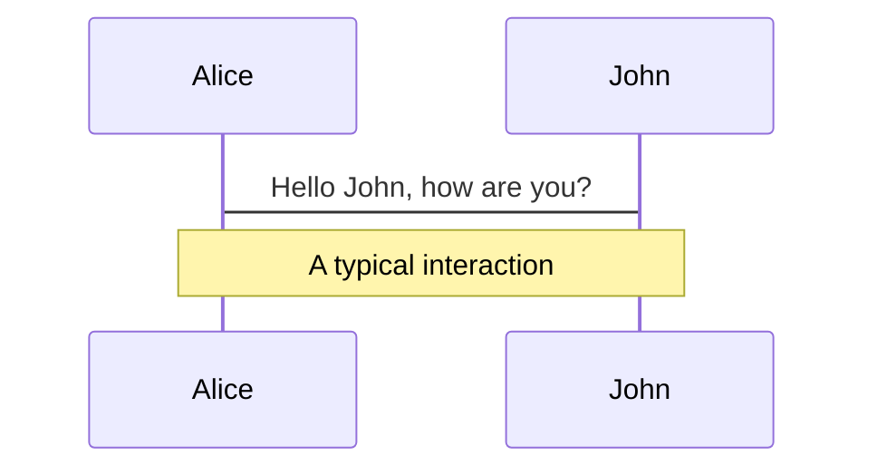
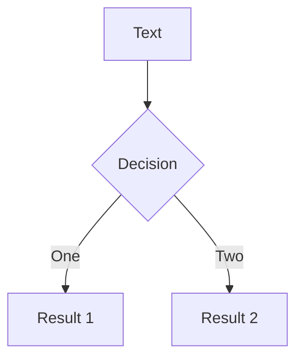
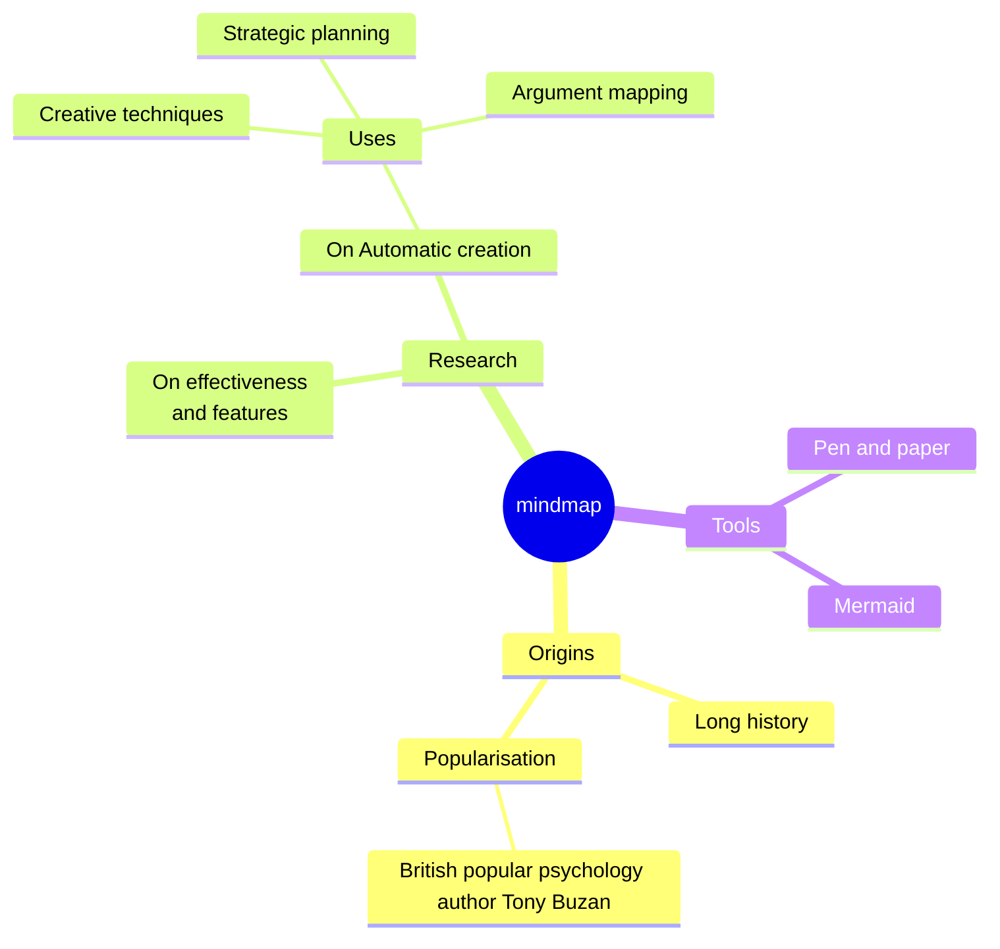
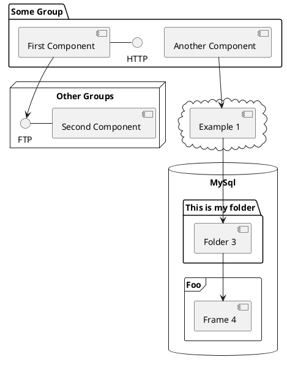

---
# You can also start simply with 'default'
theme: seriph
# random image from a curated Unsplash collection by Anthony
# like them? see https://unsplash.com/collections/94734566/slidev
background: https://cover.sli.dev
# some information about your slides (markdown enabled)
title: Babel
info: |
  ## Slidev Starter Template
  Presentation slides for developers.

  Learn more at [Sli.dev](https://sli.dev)
# apply unocss classes to the current slide
class: text-center
# https://sli.dev/features/drawing
drawings:
  persist: false
# slide transition: https://sli.dev/guide/animations.html#slide-transitions
transition: slide-left
# enable MDC Syntax: https://sli.dev/features/mdc
mdc: true
# take snapshot for each slide in the overview
overviewSnapshots: true
---

# Babel 介绍

<div class="pt-12">
  <span @click="$slidev.nav.next" class="px-2 py-1 rounded cursor-pointer" hover="bg-white bg-opacity-10">
    Press Space for next page <carbon:arrow-right class="inline"/>
  </span>
</div>

<!--
The last comment block of each slide will be treated as slide notes. It will be visible and editable in Presenter Mode along with the slide. [Read more in the docs](https://sli.dev/guide/syntax.html#notes)
-->

---

# Babel 的用途?

Babel 主要有三种用途

- 📝 **转译高级语法** - 将`esNext`，`Typescript`,`flow`,`jsx`等语法转译成目标环境支持的js语法实现；并且还可以把目标环境不支持的 api 进行 polyfill。
- 🎨 **代码转换** - Babel暴露了对代码的解析,Ast解析和转换，目标代码的生成；可以通过Ast的增删改查实现代码的转换（如函数插装，自动国际化等）
- 🛠 **代码的静态分析**

  - linter 基于ast进行语法检查
  - api 文档自动生成工具，可以提取源码中的注释，然后生成文档。
  - 混淆工具（tenser）删除 Dead code, 变量名混淆替换等能力，实现代码压缩

  <br>

  <br>

---

# Babel编译流程

Babel编译分成三步：

- 🏟️ parse阶段：对源码进行parse，解析成对应的Ast树
- 🔥 transform阶段：对Ast进行增删改，实现一个符合目标的新语法树
- 📦 generate阶段：将转换后的Ast树生成对应的目标代码和sourceMap


<br/>

---

## parse阶段

babel通过词法分析，语法分析对源码进行拆解，将源码拆成拆成对应的词法单元（token）；然后将词法单元组装（语法分析）生成对应的语法单元（Ast节点）；Ast树就是由Ast节点构成的。<br/><br/>
例如：<span class="color-red">`let name = 'guang'`</span> ; 将其拆分成不能细分的token， <span class="color-red">`let`, `name`, `=`, `'guang'`</span>，这个过程是词法分析，按照单词的构成规则来拆分字符串成单词。


---

## transform 阶段

transform阶段通过遍历语法树，增删改查，实现树-树的转换


---

## generate 阶段

generate 阶段把源码打印成字符串，生成源码对应的sourceMap


---

# Babel常用工具包

- <span class="color-orange font-bold">@babel/parser</span> 将源码解析成Ast树

- <span class="color-orange font-bold">@babel/traverse</span> 遍历Ast树，节点增删改查

- <span class="color-orange font-bold">@babel/template</span> 生成Ast的模版，用于批量生成Ast节点

- <span class="color-orange font-bold">@babel/types</span> 用于生成Ast节点和判断节点类型
- <span class="color-orange font-bold">@babel/generator</span> 将ast生成源码和sourceMap
- <span class="color-orange font-bold">@babel/code-frame</span> 用于代码错误显示，显示错误源码
- ...

---

# demo:去除打印

Slidev comes with powerful theming support. Themes can provide styles, layouts, components, or even configurations for tools. Switching between themes by just **one edit** in your frontmatter:

<div grid="~ cols-2 gap-2" m="t-2">

```yaml
---
theme: default
---
```

```yaml
---
theme: seriph
---
```


</div>

Read more about [How to use a theme](https://sli.dev/guide/theme-addon#use-theme) and
check out the [Awesome Themes Gallery](https://sli.dev/resources/theme-gallery).

---

# Clicks Animations

You can add `v-click` to elements to add a click animation.

<div v-click>

This shows up when you click the slide:

```html
<div v-click>This shows up when you click the slide.</div>
```

</div>

<br>

<v-click>

The <span v-mark.red="3"><code>v-mark</code> directive</span>
also allows you to add
<span v-mark.circle.orange="4">inline marks</span>
, powered by [Rough Notation](https://roughnotation.com/):

```html
<span v-mark.underline.orange>inline markers</span>
```

</v-click>

<div mt-20 v-click>

[Learn more](https://sli.dev/guide/animations#click-animation)

</div>

---

# Motions

Motion animations are powered by [@vueuse/motion](https://motion.vueuse.org/), triggered by `v-motion` directive.

```html
<div
  v-motion
  :initial="{ x: -80 }"
  :enter="{ x: 0 }"
  :click-3="{ x: 80 }"
  :leave="{ x: 1000 }"
>
  Slidev
</div>
```

<div class="w-60 relative">
  <div class="relative w-40 h-40">
    
    
    
  </div>

  <div
    class="text-5xl absolute top-14 left-40 text-[#2B90B6] -z-1"
    v-motion
    :initial="{ x: -80, opacity: 0}"
    :enter="{ x: 0, opacity: 1, transition: { delay: 2000, duration: 1000 } }">
    Slidev
  </div>
</div>

<!-- vue script setup scripts can be directly used in markdown, and will only affects current page -->
<script setup lang="ts">
const final = {
  x: 0,
  y: 0,
  rotate: 0,
  scale: 1,
  transition: {
    type: 'spring',
    damping: 10,
    stiffness: 20,
    mass: 2
  }
}
</script>

<div
  v-motion
  :initial="{ x:35, y: 30, opacity: 0}"
  :enter="{ y: 0, opacity: 1, transition: { delay: 3500 } }">

[Learn more](https://sli.dev/guide/animations.html#motion)

</div>

---

# LaTeX

LaTeX is supported out-of-box. Powered by [KaTeX](https://katex.org/).

<div h-3 />

Inline $\sqrt{3x-1}+(1+x)^2$

Block

$$
{1|3|all}
\begin{aligned}
\nabla \cdot \vec{E} &= \frac{\rho}{\varepsilon_0} \\
\nabla \cdot \vec{B} &= 0 \\
\nabla \times \vec{E} &= -\frac{\partial\vec{B}}{\partial t} \\
\nabla \times \vec{B} &= \mu_0\vec{J} + \mu_0\varepsilon_0\frac{\partial\vec{E}}{\partial t}
\end{aligned}
$$

[Learn more](https://sli.dev/features/latex)

---

# Diagrams

You can create diagrams / graphs from textual descriptions, directly in your Markdown.

<div class="grid grid-cols-4 gap-5 pt-4 -mb-6">









</div>

Learn more: [Mermaid Diagrams](https://sli.dev/features/mermaid) and [PlantUML Diagrams](https://sli.dev/features/plantuml)

---

foo: bar
dragPos:
square: 691,32,167,\_,-16

---

dragPos:
square: -87,0,0,0

---

dragPos:
square: -87,0,0,0

---

dragPos:
square: -87,0,0,0

---

dragPos:
square: -87,0,0,0

---

dragPos:
square: -87,0,0,0

---

dragPos:
square: -87,0,0,0

---

dragPos:
square: -87,0,0,0

---

dragPos:
square: -87,0,0,0

---

dragPos:
square: -87,0,0,0

---

dragPos:
square: -87,0,0,0

---

dragPos:
square: -87,0,0,0

---

dragPos:
square: -87,0,0,0

---

dragPos:
square: -87,0,0,0

---

dragPos:
square: -87,0,0,0

---

dragPos:
square: -87,0,0,0

---

# Draggable Elements

Double-click on the draggable elements to edit their positions.

<br>

###### Directive Usage

```md

```

<br>

###### Component Usage

```md
<v-drag text-3xl>
  <carbon:arrow-up />
  Use the `v-drag` component to have a draggable container!
</v-drag>
```

<v-drag pos="666,243,261,\_,-15"undefinedundefinedundefinedundefinedundefinedundefinedundefinedundefinedundefinedundefinedundefinedundefinedundefinedundefinedundefinedundefinedundefinedundefinedundefinedundefinedundefinedundefinedundefinedundefinedundefinedundefinedundefinedundefinedundefinedundefinedundefinedundefinedundefinedundefinedundefinedundefinedundefinedundefinedundefinedundefinedundefinedundefinedundefinedundefinedundefinedundefinedundefinedundefinedundefinedundefinedundefinedundefinedundefinedundefinedundefinedundefinedundefinedundefinedundefinedundefinedundefinedundefinedundefinedundefinedundefinedundefinedundefinedundefinedundefinedundefinedundefinedundefinedundefinedundefinedundefinedundefinedundefinedundefinedundefinedundefinedundefinedundefinedundefinedundefinedundefinedundefinedundefinedundefinedundefinedundefinedundefinedundefinedundefinedundefinedundefinedundefinedundefinedundefinedundefinedundefinedundefinedundefinedundefinedundefinedundefinedundefinedundefinedundefinedundefinedundefined>

  <div text-center text-3xl border border-main rounded>
    Double-click me!
  </div>
</v-drag>


###### Draggable Arrow

```md
<v-drag-arrow two-way />
```

<v-drag-arrow pos="67,452,253,46" two-way op70 />

---

src: ./pages/imported-slides.md
hide: false

---

---

# Monaco Editor

Slidev provides built-in Monaco Editor support.

Add `{monaco}` to the code block to turn it into an editor:

```ts {monaco}
import { ref } from "vue";
import { emptyArray } from "./external";

const arr = ref(emptyArray(10));
```

Use `{monaco-run}` to create an editor that can execute the code directly in the slide:

```ts {monaco-run}
import { version } from "vue";
import { emptyArray, sayHello } from "./external";

sayHello();
console.log(`vue ${version}`);
console.log(
  emptyArray<number>(10).reduce(
    (fib) => [...fib, fib.at(-1)! + fib.at(-2)!],
    [1, 1]
  )
);
```

---

layout: center
class: text-center

---

# Learn More

[Documentation](https://sli.dev) · [GitHub](https://github.com/slidevjs/slidev) · [Showcases](https://sli.dev/resources/showcases)

<PoweredBySlidev mt-10 />
